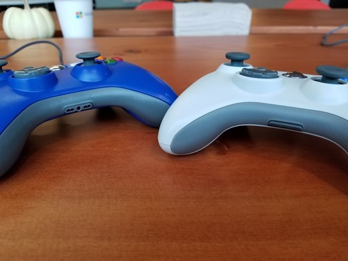

test 10

# FAQ

If you have any issues not answered by this FAQ or would like to suggest additional topics please email us directly at <KoduSupport@InfiniteInstant.com>.

Be sure to also check out the **Tips** page for Tips and Tricks when working with Kodu.

## What is Kodu?
Kodu lets kids create games on the PC via a simple visual programming language. Kodu can be used to teach creativity, problem solving, storytelling, as well as programming. Anyone can use Kodu to make a game, young children as well as adults with no design or programming skills.

Since Kodu's introduction in 2009, we have visited the White House, teamed up with great groups like [NCWIT](https://www.ncwit.org/) and [DigiGirlz](https://www.microsoft.com/en-us/diversity/programs/digigirlz/default.aspx), inspired academic research and been the subject of a book, [Kodu for Kids](https://smile.amazon.com/Kodu-Kids-Official-Guide-Creating/dp/0789750767).

## Is Kodu free?
Kodu is completely free to use and requires no product keys.

## Where can I download Kodu?
Kodu can be downloaded here:

[**Kodu Downloads**](../downloads)

We have both an EXE and an MSI installer available depending on your needs.  In general, most user will choose the EXE installer.  The MSI installer is meant for system admins who are deploying Kodu to whole networks.

## What systems does Kodu run on?
Windows Vista and newer. Windows 10 recommended.

## Is Kodu available on Mac or Android?
Kodu is not available on the Mac or Android.  Currently we have no plans for doing a port.  However, Kodu does run well when running Windows on a Mac using BootCamp.

## Is Kodu available on the Xbox?
No. Originally Kodu was available on the Xbox 360.  On the Xbox 360, Kodu was distributed via the Indie Games channel.  The Indie Games program was shut down in late 2017.  People who purchased Kodu prior to the shutdown can still reinstall Kodu but no new purchases are supported.

## What Controllers are supported?
We use Microsoft Xbox 360 wired controllers most of the time.  We’ve also tested the newer, Xbox One wired controllers and those work as well.

In testing non-Microsoft brand controllers the results have been mixed.  Some act the same as the Microsoft ones, others need additional software in order to work.

The picture above contains two of the non-Microsoft controllers we’ve tested.  What we’ve found is that the controllers that support plugging in a headset tend to work without a problem.  They are recognized by the system as Xbox controllers and support all the functions.  Those that have this feature removed aren’t recognized as Xbox controllers.  You can see the different in the picture.  The blue controller has the normal headset plug visible on its bottom edge.  On the white controller this has been replaced by a plastic plug.

If you have a controller that is not recognized by the system as an Xbox controller you can use the Xbox 360 Controller Emulator software to make it work.  The software can be found here: <http://www.x360ce.com>

## What languages are supported by Kodu?
Currently Kodu supports the following languages:  Arabic, Basque, Chinese (simplified and traditional), Czech, Dutch, English, French, German, Greek, Hebrew, Hungarian, Icelandic, Italian, Japanese, Korean, Lithuanian, Norwegian, Polish, Portuguese, Russian, Spanish, Turkish, Vietnamese, and Welsh.

To select the current language, choose “Options” from the Main Menu, scroll down to the “Language” tile, and select the language you want.   Kodu will need to be restarted for the language change to take effect.

See also: [Language Tip](../tips/language)

## Can you translate Kodu for a new language?
All the translations for Kodu have been done by volunteers in our community.  Because of this, some of the translations may be incomplete.  If you would like to help fill in missing parts of a translation or take on a new language we’d love your help.  The first step is to download this document explaining the translation process: 
[Kodu Localization](KoduLocalization.docx)  If you have any questions about the process or have some work you’d like to submit, email <KoduSupport@InfiniteInstant.com>.

## Kodu crashed. What should I do?
The most common cause of issues running Kodu is bad graphics chipset drivers.  Many systems ship with older versions of the drivers which can fail.  So, the first thing to try is to go to your graphics chipset manufacturer’s web site, download and install the latest driver for your system.  If you need any help figuring out how to do this, please email us at KoduSupport@InfiniteInstant.com and we can help.

If updating your graphics driver doesn’t solve the problem, then it’s most likely a problem with Kodu.  Please email us with information about the crash.  If possible please include the version of Kodu you have, the version of Windows you are using, and any information in the crash dialog.  For most crashes, Kodu will display a crash dialog with information about the crash.  This information can be cut and paste into the email.

## Can I make custom tutorials?
Here’s a doc we wrote a while ago about doing this.  It’s a bit complicated and finicky but it can be done.  Email us if you have any questions or run into problems: KoduSupport@InfiniteInstant.com

[How to Create Kodu Tutorial Levels](HowToCreateKoduTutorialLevels.docx)

## How can I backup or transfer games between machines?
To transfer games between machines you have 2 options: 

1. Share the game to the community and then download it onto the new PC.
2. Use the “Export” option.  This will create a file with the extension .Kodu2.  You can save this on a USB drive.  On the target machine, insert the USB drive and double-click the file.  This will launch Kodu and import the file.  
 
See also: [Export World Tip](../tips/export_world)

## Questions?
For questions or any support issues, email <KoduSupport@InfiniteInstant.com>.