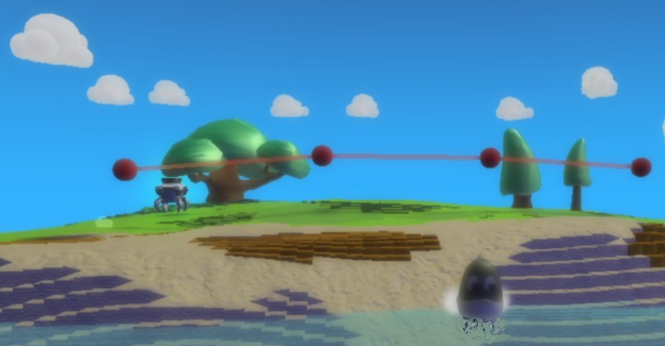
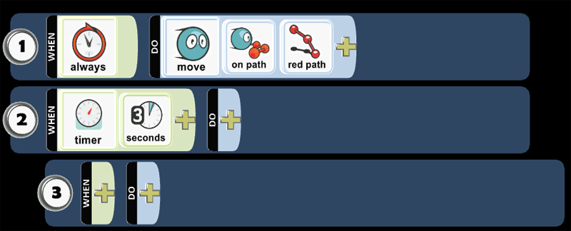
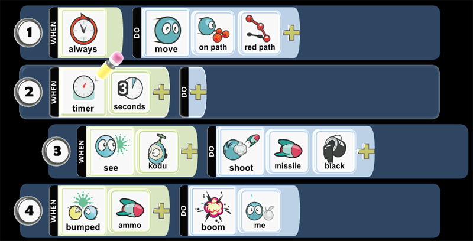
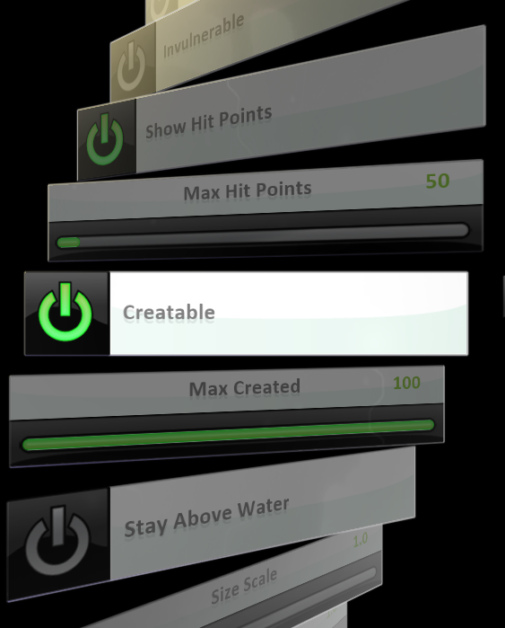
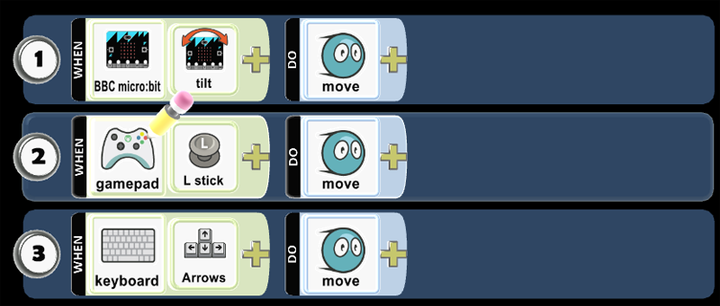
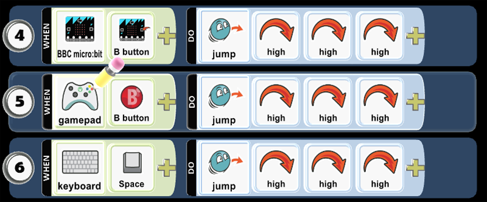
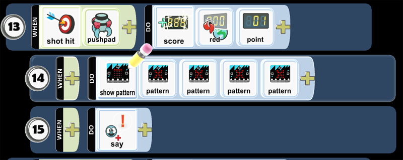
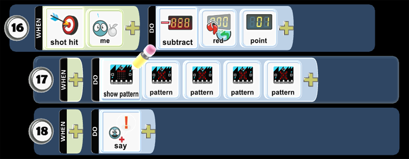
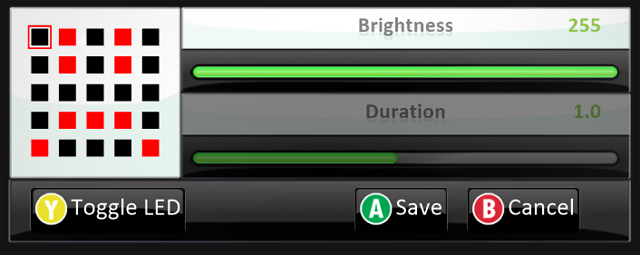
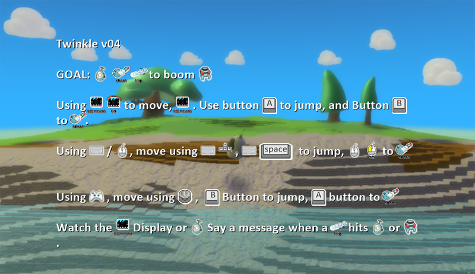

---
title:
subtitle:
layout: page
show_sidebar: false
hide_hero: true
---

[Home](../..)/[Resources](..)/Twinkle

  

## Twinkle

* Project 5: Twinkle
* Student Ages: 09-14 years old
* Activity Time: 60 minutes 
* Activity Level: Beginner Coder

### Prerequisites
* Download and Installation of Kodu
* Get Started Instructions: [BBC micro:bit](microbit)
  * Connect your micro:bit to a computer via USB cable
  * Install the [mbed serial port driver](https://developer.mbed.org/media/downloads/drivers/mbedWinSerial_16466.exe)
  * Start Kodu (version 1.4.84.0 or later). It will detect your micro:bit and enable the micro:bit programming tiles.
  * [Project 1: Capture Love](capture_love)
  * [Project 2: Jump](jump)
  * [Project 3: Reach Castle](reach_castle)
  * [Project 4: Bucket Toss](bucket_toss)
 

### Learning Objectives
* Create a complex Kodu World with game effects using BBC micro:bit Show Pattern and Pattern.

### Contents
* [Completed World: Twinkle](https://worlds.kodugamelab.com/world/CtE_WSUVGE-6m0U_wAu0Uw==)
* [Completed Kode for Level: Twinkle](Twinkle_Kode_for_Level1.pdf)
* Project: Twinkle (micro:bit show pattern, micro:bit pattern)

### Student Activities
To create a Kodu world using tiles specific the BBC micro:bit, make sure you connect a micro:bit device and install the mbed serial port driver

**Welcome! This activity will teach you how to show patterns when interacting with a computer opponent. Let's get started!**

#### Step 1: Add Objects

Start Kodu Game Lab. Select the New World option from the Main Menu, and Kodu Game Lab will open and display a patch of ground directly in the center of the screen.

Select the Object tool (the Kodu icon on the toolbar). With a game controller, select the Object tool using the left thumbstick.

* For mouse users, move the mouse pointer to the center of the terrain and click and release the left mouse, which open the pie menu. Use your mouse to select the Kodu object or another moving object (except Rover).
* For game controller users, move the camera to the center of the terrain and press the A button, which open the pie menu. Use the game controller to select the object. Use your game controller to select Kodu or another moving object (except Rover). After adding the object to the terrain, press button B for the Tool Menu.

Finally, you want to add the computer's moving object, like a Push Pad and a nonmoving object, such as the Rock.

#### Step 2: Path Following

We need to create a red path for the Push Pad to follow. The path might appear as a straight line, square, or random. Select the Path tool, it's to the right of the Object tool and looks like three balls connected with tubes. The path tool lets you add terrain and place small spheres.

Using a mouse, every time you left-click with the mouse, a small sphere is placed and the tube will continue to connect. After you draw Push Pad's path to follow, click on the starting sphere to close the path.
Using a game controller, the Path tool is selected using the Object tool and select the Path tool as a pie slice with the A button. You want to select the plain Path tool. Add an additional node (small sphere) with the A button. After you draw Push Pad's path to follow, press B button to close the path.

#### Tips and Tricks: Path Following

* Path Color. If you need to modify the path color, place the cursor over an existing sphere, use the Left or Right arrows to change the path color.
* Modify Path. If want to modify the path, left click and hold on the sphere to drag the sphere.
* Move Path. If you want to move the path, hold down Shift key and left click and hold on the path.

#### Step 3: Program Push Pad - Follow Red Path

Let's program the Push Pad to always move on the red path. Select the Object tool, right click on the Push Pad and select Program. Using a wired controller, move cursor over Push Pad, then press button Y.

* Play Game to see if the code works as expected.

#### Step 4: Program Push Pad - Timer

Let's program a Timer tile to track how much time has elapsed and triggers an action after 3 seconds from when the game starts.

#### Step 5: Program Push Pad -Indentation (Move Row)

You want to tuck programming Row 3 underneath 2 so any programming placed in 2 is always being checked for a condition that will trigger the action. Row 3 moves to the right and is a child of 2. Click the 3 and hold down the mouse button while dragging to the right.

#### Step 6: Program Push Pad - Projectiles

Let's program the Push Pad to see Kodu and shoot a black missile. Push Pad will not shoot a black missile until it sees Kodu. The timer delays shooting the black missile. When Push Pad bumps ammo, you want to Boom Push Pad. 

* Play Game to see if the code works as expected.

#### Step 7: Push Pad Creatable - Change Settings

You want to make Push Pad a creatable. We want to make Push Pad a creatable to reuse the object. Push Pad will respawn when it has been destroyed.
* Using a mouse, select the object tool, the right-click on Push Pad then select Change Settings. You want to scroll down to Creatable option and turn it on so it turns green.
* Using a wired controller, move cursor over Push Pad, then open Settings with B button. You want to scroll down to Creatable option and turn it on so it turns green.

#### Step 8: Program Rock - Page 1 - Create Push Pad

You want to allow continuous gameplay between you and the computer. Using the Pages tool, you can change behaviors and create new scenes. Let's program the nonmoving object, such as a rock. The nonmoving object will always see when Push Pad is not in the world. 

#### Step 9: Program Rock - Page 2

When Push Pad is not in the world, then the game will switch from Page 1 to Page 2! You need to tell Page 1 to move to Page 2, which ensures the game is affected by the programming on Page 2. You will switch from Page 1 to Page 2! Once your pencil moves to the Pages tool, you can click the left or right buttons with the mouse. Try to click through to Page 2. When you switch to Page 2, notice that it's completely blank.

#### Step 10: Program Rock - Page 2 - Create Push Pad

The Push Pad cannot create itself, so you need to the Rock to create a new Push Pad when it has been destroyed. You will find Push Pad as a creatable. When the Rock does not see Push Pad in the world, after 2 seconds, then the Rock will create a new Push Pad. 

#### Step 11: Program Rock - Page 2 - Create Push Pad

When Push Pad is not in the world, then the game will switch from Page 1 to Page 2! You need to tell Page 1 to move to Page 2, which ensures the game is affected by the programming on Page 2. You will switch from Page 1 to Page 2! Once your pencil moves to the Pages tool, you can click the left or right buttons with the mouse or toggle on the D-Pad with a wired controller. Try to move to Page 2. When you switch to Page 2, notice that it's completely blank.

You want Push Pad to vanish from the world for 2 seconds before Push Pad appears. You want to stay on Page 2 for 2 seconds before returning to Page 1. After 2 seconds is over, you want to switch to Page 1.

* Play Game to see if the code works as expected.

#### Step 12: Program Kodu - Move

You want to move Kodu using the BBC micro:bit tilt.

* Using a mouse, select the Object tool and right-click the mouse on the object, Kodu. Select the Program option for Kodu. Select the When box with left-click of the mouse.
* Using a game controller, use the Object tool and move the control circle over the object and press Y button. Press the A button on the When box.

Kodu uses the accelerometer on the BBC micro:bit. The accelerometer detects movement on the BBC micro:bit with tilt. The accelerometer detects changes in the micro:bit’s speed and detects a standard action such as tilt. You use tilt to register an event that will run when a tilt event happens.

Alternatively, Kodu can use the L-stick on the Wired Controller or Keyboard Up/Down/Lt/Rt to move.

* Play Game to see if the code works as expected.

#### Step 13: Program Kodu - Jump

How about using the BBC micro:bit buttons? We want an action to execute whenever an input button is pressed during program execution. Let's add code that will run when BBC micro:bit button A is pressed on the micro:bit! You want Kodu to jump very high when button B is pressed. 

Alternatively, Kodu can use the Button B on the Wired Controller or Mouse left-click to jump.

* Play Game to see if the code works as expected.

#### Step 14: Program Kodu - Shoot Projectile

Let's add code that will run when button A is pressed! You want Kodu to shoot a blip when button A is pressed on BBC micro:bit or wired controller. Alternatively, you can use keyboard space key. 

* Play Game to see if the code works as expected.

#### Step 15: Program Kodu - Scoreboard Red

Let's add code that will run when a shot hit Push Pad! You want Kodu to score 1 point. 

* Play Game to see if the code works as expected.

#### Step 16: Program Kodu - Show Pattern

Let's add Show Pattern when a shot hit Push Pad! You want to add Pattern and Pattern to draw on the micro:bit LED display. You want to draw a pattern on the micro:bit LED screen using Pattern. You can add several Pattern tiles. In this example, there are four (4) Pattern tiles. 

You can also have Kodu say a Thought Balloon.

Tips and Tricks: Program Kodu - Pattern

You will left click on Pattern to draw an image on the micro:bit LED screen. Create a pattern with an image to display a smile then click Save. Create a second pattern with an image with no LEDs lit up. If you repeat this logic in the pattern tiles, alternating between a smile and having no LEDs lit up, then you will have a pattern that appears as an animation.  

* Play Game to see if the code works as expected.

#### Step 17: Program Kodu - Scoreboard Red

Let's add code that will run when a shot hit me! You want Kodu to score -1 point. 

* Play Game to see if the code works as expected.

#### Step 18: Program Kodu - Show Pattern

Let's add Show Pattern when a shot hit me! You want to draw a pattern on the micro:bit LED screen using Pattern. You can add several Pattern tiles. In this example, there are four (4) Pattern tiles. 

You can also have Kodu say a Thought Balloon.

#### Tips and Tricks: Program Kodu - Pattern

You will left click on Pattern to draw an image on the micro:bit LED screen. Create a pattern with an image to display sad then click Save. Create a second pattern with an image with no LEDs lit up. If you repeat this logic in the pattern tiles, alternating between sad and having no LEDs lit up, then you will have an animation.  

* Play Game to see if the code works as expected.

#### Step 19: Save World

You want to save your work. The Game Save Screen is useful in managing the game development. You go to Home Menu then select Save my world. You want to type the game name in the Name field and describe the gameplay as well as rules of the game in the Description, then click or press Save. Finally, you want to select Change World Settings, scroll down to Start Game With, and select Description with Countdown.

* Play Game to see if the directions appear as expected.

### Skills
Character,
Citizenship,
Collaboration,
Communication,
Creativity,
Critical Thinking,
Project Based Learning

